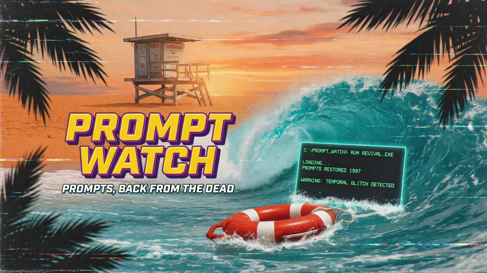
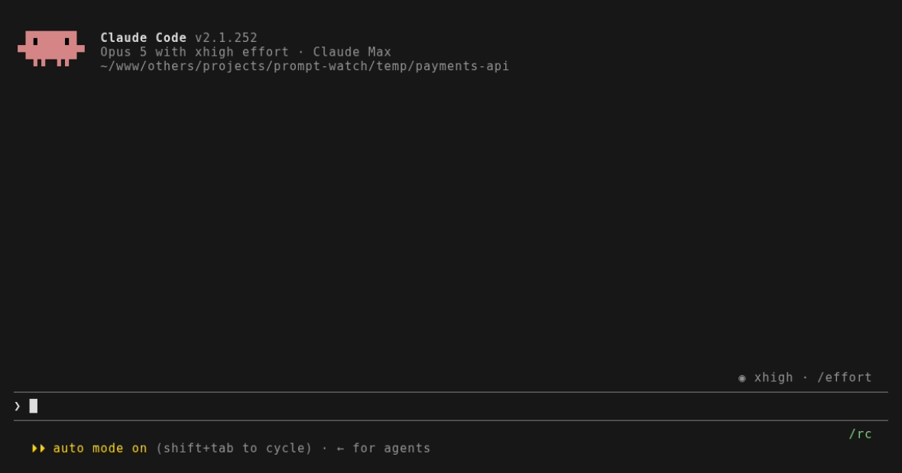

# prompt-watch

**Prompts, back from the dead.**



[](https://github.com/kuzmany/prompt-watch/actions/workflows/ci.yml)
[](LICENSE)


Terminal AI agents never write the prompt you are typing to disk. Kill the
pane, crash the process, hit Ctrl+C at the wrong moment — a 500-word prompt
is gone. prompt-watch is the lifeguard on that beach: it snapshots the prompt
box of every agent pane in tmux every 10 seconds, so a crash costs you nothing.



*Type a long prompt, the agent dies, Alt+G, Enter — the draft is back. Real
Claude Code, real recovery; only the agent's boot time is trimmed.*

Works with **Claude Code** and **Codex CLI**. The gap is real across all
agent CLIs: none of them persist the unsent prompt
([openai/codex#23085](https://github.com/openai/codex/issues/23085) is still
open), and every existing recovery tool reads only *submitted* history.

## Install

```bash
curl -fsSL https://raw.githubusercontent.com/kuzmany/prompt-watch/main/install.sh | bash
```

Flags: `--yes` (no questions), `--key M-r` (different picker key),
`--ctrl-g` (exact-copy alias, see below), `--uninstall` (clean removal).
Needs tmux and bash ≥ 4.2 (macOS: `brew install bash`).

### Let your agent install it

Paste this into Claude Code, Codex CLI, Grok CLI, or any terminal agent —
it installs prompt-watch and proves it works before it says it is done:

```text
Install prompt-watch from https://github.com/kuzmany/prompt-watch — it snapshots
the prompt box of AI agent panes in tmux so an unsent prompt survives a crash.

1. Check the prerequisites first: `tmux -V` (any version with popups, 3.2+) and
   `bash --version` (need 4.2+). Say so and stop if either is missing.
2. Read https://raw.githubusercontent.com/kuzmany/prompt-watch/main/install.sh
   before running anything, and tell me what it changes. Then install with:
   `curl -fsSL https://raw.githubusercontent.com/kuzmany/prompt-watch/main/install.sh | bash -s -- --yes`
   Append `--ctrl-g` to that command only if I use Claude Code and want Ctrl+G
   to copy the exact prompt buffer (it adds one alias to my shell rc).
3. Run `~/.local/bin/prompt-watch doctor` and show me the output. Every line
   must be ok or info. If the daemon line says it is not running, run
   `~/.local/bin/prompt-watch ensure`, wait a second, and check again.
4. Tell me the picker key it installed (Alt+G by default) and how to change it.
   Do not modify my tmux config by hand — the installer owns that block.
5. If `~/.local/bin` is not on my PATH, tell me the exact line to add.

Then stop. Do not start the picker for me: it is interactive and I will press
Alt+G myself.
```

## Use

You learn two gestures:

- **Alt+G** — the picker pops up with your 10 most recent drafts.
  `1`–`9` picks a row, `↑`/`↓` moves, **Enter** inserts the draft back into
  the pane you came from, `c` copies it to the clipboard, `q` quits.
- **`prompt-watch doctor`** — one-line health checks when something feels off.

That's it. The daemon runs invisibly, starts itself, and survives nothing —
if it dies, the next picker open restarts it.

### Ctrl+G: the exact copy (Claude Code only)

Screen scraping reads what is visible. Ctrl+G reads the truth: Claude Code's
external-editor feature writes the real prompt buffer to a file, and the
`prompt-watch-visual` shim copies it to the clipboard without changing the
prompt. Enable with `install.sh --ctrl-g` — it aliases `claude` to set
`$VISUAL` for that command only, so `git commit` keeps your real editor.

## Supported agents

| Agent | Auto-snapshot | Exact copy (Ctrl+G) |
|---|---|---|
| Claude Code | yes | yes |
| Codex CLI | yes | no equivalent found yet |

Adding an agent is one process-name row plus one composer parser
(`parse_box_*` in `bin/prompt-watch`) — PRs welcome, fixtures included.

## How it works

1. One daemon wakes every 10 s and lists tmux panes once.
2. Panes running an agent whose window was active in the last 10 minutes get
   captured; an untouched pane cannot be growing a draft.
3. A per-agent parser extracts the prompt box (Claude: the region between
   the last two horizontal rules opening with `❯`; Codex: the trailing `›`
   block).
4. Changed text of 15+ characters is saved. A draft that extends the pane's
   last snapshot — or any recent stored draft — overwrites that entry
   instead of duplicating it.
5. The newest 200 drafts are kept as plain files in
   `~/.local/state/prompt-watch/`.

## Honest limits

- tmux only. Without a pane there is nothing to read.
- A draft typed and lost inside one 10 s interval is never seen.
- Only the visible part of the box; a soft wrap is indistinguishable from a
  real newline, and a blank line ends the Codex block.
- Pasted blocks render as `[Pasted text #N]`, so scraping cannot recover
  them (Claude Code keeps the bytes in `~/.claude/paste-cache/`).
- Claude Code's dim ghost suggestions can be captured as if you typed them.
  Its empty-box placeholders (`Press up to edit…`, the rotating `Try "…"`) are
  filtered out; inline completions still look like typed text to a screen read.
- Drafts are plaintext — same exposure as your shell history.

## Config

<details>
<summary>Environment variables (defaults are fine)</summary>

| Variable | Default | Meaning |
|---|---|---|
| `PW_DIR` | `~/.local/state/prompt-watch` | draft storage |
| `PW_INTERVAL` | `10` | seconds between snapshots |
| `PW_KEEP` | `200` | drafts kept |
| `PW_IDLE` | `600` | skip windows idle longer than this (s) |
| `PW_MINLEN` | `15` | minimum draft length saved |
| `PW_SCAN` | `30` | recent drafts checked for continuation |

Hidden commands for scripts: `prompt-watch list [N]`, `show N`, `copy [N]`.

</details>

## License

MIT
